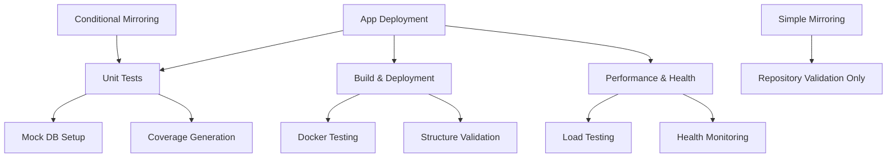

# GitHub Actions Workflows Documentation

This repository uses a modular GitHub Actions workflow structure for CI/CD operations. Below is the documentation for each workflow and how they interact.

## Workflow Structure Overview

### 1. **Conditional Mirroring** (`conditional_mirroring.yml`)
- **Triggers**: Commits on `main`, `dev` branches and all Pull Requests (except `ga-ignore-*` branches)
- **Purpose**: Runs comprehensive testing before mirroring to external repository
- **Jobs**:
  - Repository validation (checks for unwanted files)
  - Calls Unit Tests workflow with coverage generation
  - Mirrors to external repository on success

### 2. **Simple Mirroring** (`mirroring.yml`)
- **Triggers**: Commits on all branches except `main`, `dev`, and `ga-ignore-*`
- **Purpose**: Simple repository validation and mirroring without extensive testing
- **Jobs**:
  - Repository validation only
  - Direct mirroring to external repository

### 3. **Unit Tests** (`unit_tests.yml`) - Reusable Workflow
- **Triggers**: Only via `workflow_call` from other workflows
- **Purpose**: Comprehensive unit and integration testing with mock database
- **Features**:
  - Mock PostgreSQL database setup
  - Backend and Frontend testing
  - Optional test coverage generation
  - Prisma schema and seeding support
  - Configurable Node.js version

### 4. **Build & Deployment Testing** (`build_deployment.yml`) - Reusable Workflow
- **Triggers**: Only via `workflow_call` from other workflows
- **Purpose**: Tests Docker builds, compose setup, and application structure
- **Features**:
  - Individual Docker image builds
  - Docker Compose integration testing
  - Application structure validation
  - Dependency security audits
  - Build artifact generation

### 5. **Performance & Health Checks** (`performance_health.yml`) - Reusable Workflow
- **Triggers**: Only via `workflow_call` from other workflows
- **Purpose**: Performance testing, load testing, and health monitoring
- **Features**:
  - Load testing with Artillery and Autocannon
  - Memory leak detection
  - Performance profiling
  - Health endpoint monitoring
  - Resource usage analysis

### 6. **App Deployment Pipeline** (`app_deployment.yml`)
- **Triggers**: Commits on `main`, `dev` branches and manual workflow dispatch
- **Purpose**: Complete deployment pipeline orchestrating all testing and deployment
- **Jobs**:
  - Repository validation
  - Calls Unit Tests workflow
  - Calls Build & Deployment Testing workflow
  - Calls Performance & Health Checks workflow
  - Staging deployment (for `dev` branch)
  - Production deployment (for `main` branch)
  - Post-deployment verification

## Environment Variables and Secrets

### Required Secrets
- `SSH_PRIVATE_KEY`: SSH key for repository mirroring
- `MIRROR_URL`: Target repository URL for mirroring

### Environment Variables
- `NODE_VERSION`: Node.js version (default: '18')
- `POSTGRES_USER`: PostgreSQL username for testing
- `POSTGRES_PASSWORD`: PostgreSQL password for testing
- `POSTGRES_DB`: PostgreSQL database name for testing

## Usage Examples

### Running Unit Tests Only
Unit tests are automatically triggered by conditional mirroring and app deployment workflows, but can be called manually:

```yaml
jobs:
  test:
    uses: ./.github/workflows/unit_tests.yml
    with:
      generate_coverage: true
      node_version: '18'
```

### Running Build Tests
```yaml
jobs:
  build:
    uses: ./.github/workflows/build_deployment.yml
    with:
      environment: 'staging'
```

### Running Performance Tests
```yaml
jobs:
  performance:
    uses: ./.github/workflows/performance_health.yml
    with:
      target_url: 'http://localhost:4242'
      load_test_duration: '60'
```

## Branch Strategy

- **`main` branch**: 
  - Triggers full deployment pipeline
  - Includes unit tests, build tests, performance tests
  - Deploys to production environment
  - Generates coverage reports

- **`dev` branch**: 
  - Triggers full deployment pipeline
  - Includes unit tests, build tests, performance tests
  - Deploys to staging environment
  - Generates coverage reports

- **Feature branches**: 
  - Simple mirroring only (no tests)
  - Repository validation
  - Direct mirror to external repository

- **Pull Requests**: 
  - Full testing suite via conditional mirroring
  - Generates coverage reports
  - No deployment

## Mock Database Setup

The unit tests workflow includes automatic mock database setup:

1. **PostgreSQL Service**: Starts a test PostgreSQL instance
2. **Schema Generation**: Runs `prisma generate` if schema exists
3. **Database Push**: Applies schema with `prisma db push --force-reset`
4. **Seeding**: Runs seeding scripts if available
5. **Environment**: Sets appropriate test environment variables

## Docker Testing

The build & deployment testing workflow includes:

1. **Individual Build Tests**: Tests each Dockerfile separately
2. **Compose Integration**: Tests complete docker-compose setup
3. **Mock Compose**: Uses simplified compose file for testing
4. **Health Checks**: Validates service health and connectivity
5. **Resource Cleanup**: Ensures proper cleanup after tests

## Performance Testing Tools

- **Artillery**: Load testing and scenario-based testing
- **Autocannon**: HTTP benchmarking and performance testing
- **Clinic.js**: Performance profiling and monitoring
- **System Monitoring**: Memory, CPU, and disk usage tracking

## Artifacts Generated

### Test Artifacts
- Backend and Frontend coverage reports
- Test execution reports
- Performance test results

### Build Artifacts
- Deployment packages for staging/production
- Build reports and logs
- Docker image information

### Performance Artifacts
- Artillery load test reports (JSON and HTML)
- Autocannon benchmarking results
- Performance monitoring reports
- Health check results

## Workflow Dependencies



## Troubleshooting

### Common Issues

1. **Unit Tests Failing**: Check mock database setup and environment variables
2. **Docker Build Failures**: Verify Dockerfile syntax and dependencies
3. **Performance Test Timeouts**: Adjust load test duration or target URLs
4. **Mirroring Failures**: Verify SSH keys and repository access

### Debug Tips

- Check workflow logs for detailed error messages
- Review artifact uploads for test reports
- Verify environment variable configuration
- Ensure all required secrets are configured

## Migration from Legacy Workflows

The previous monolithic `tests.yml` workflow has been deprecated and replaced with this modular structure. The legacy workflow is marked as deprecated and should not be used for new development.

Benefits of the new structure:
- Better separation of concerns
- Reusable workflows reduce duplication
- Easier debugging and maintenance
- More granular control over when tests run
- Better resource utilization
